# DO1_Linux darrpama

## Part 1. Установка ОС

**== Задание ==**

##### Установить **Ubuntu 20.04 Server LTS** без графического интерфейса.

 

**== Выполнение ==**

* Скриншот с выводом команды
`cat /etc/issue.`
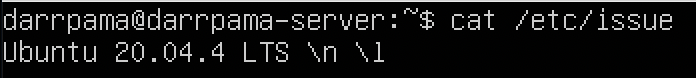

 

## Part 2. Создание пользователя

**== Задание ==**

##### Создать пользователя, отличного от пользователя, который создавался при установке. Пользователь должен быть добавлен в группу `adm`.

 

**== Выполнение ==**

* Скриншот вызова команды для создания пользователя
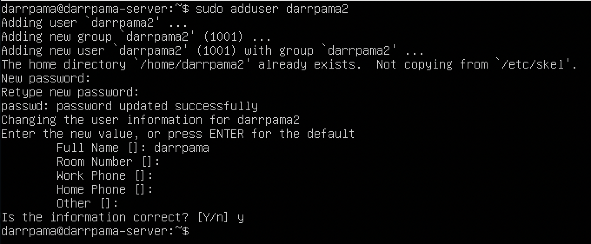
* Скриншот изменения группы пользователя
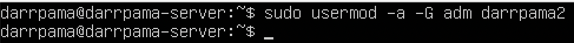
* Скриншот вызова команды `groups darrpama2` для проверки группы пользователя
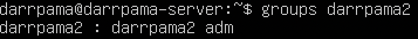
* Скриншот вывода команды `cat /etc/passwd`
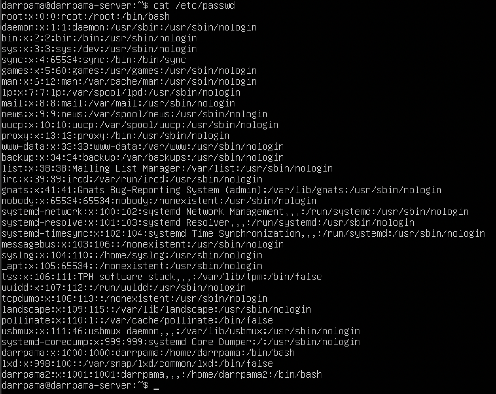

 

## Part 3. Настройка сети ОС

**== Задание ==**

##### Задать название машины вида user-1  
##### Установить временную зону, соответствующую вашему текущему местоположению.  
##### Вывести названия сетевых интерфейсов с помощью консольной команды.
- В отчёте дать объяснение наличию интерфейса lo.  
##### Используя консольную команду получить ip адрес устройства, на котором вы работаете, от DHCP сервера. 
- В отчёте дать расшифровку DHCP.  
##### Определить и вывести на экран внешний ip-адрес шлюза (ip) и внутренний IP-адрес шлюза, он же ip-адрес по умолчанию (gw). 
##### Задать статичные (заданные вручную, а не полученные от DHCP сервера) настройки ip, gw, dns (использовать публичный DNS серверы, например 1.1.1.1 или 8.8.8.8).  
##### Перезагрузить виртуальную машину. Убедиться, что статичные сетевые настройки (ip, gw, dns) соответствуют заданным в предыдущем пункте.  

- В отчёте описать, что сделано для выполнения всех семи пунктов (можно как текстом, так и скриншотами).
- Успешно пропинговать удаленные хосты 1.1.1.1 и ya.ru и вставить в отчёт скрин с выводом команды. В выводе команды должна быть фраза "0% packet loss".

 

**== Выполнение ==**

* Задал название машины вида user-1 открыв с правами суперпользователя в vi файл /etc/hostname и изменив его содержимое с darrpama-server на user-1

* Установил временную зону, соответствующую текущему местоположению с помощью команды `sudo timedatectl set-timezone Europe/Moscow`. Проверил правильность вызовом `timedatectl`.
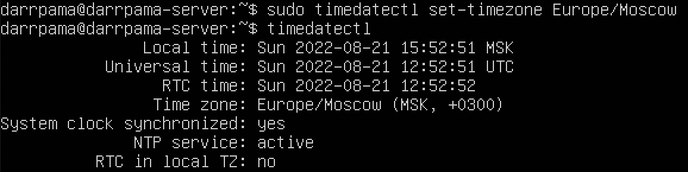

* Вывел названия сетевых интерфейсов с помощью команды `ip link show`
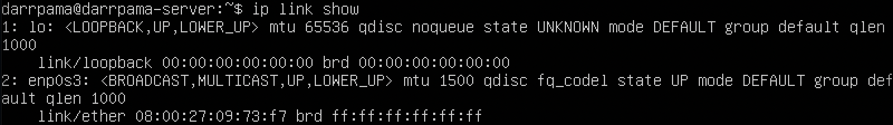
* lo (loopback device) – виртуальный интерфейс, присутствующий по умолчанию в любом Linux. Он используется для отладки сетевых программ и запуска серверных приложений на локальной машине. С этим интерфейсом всегда связан адрес 127.0.0.1. У него есть dns-имя – localhost. Он может быть использован сетевым клиентским программным обеспечением, чтобы общаться с серверным приложением, расположенным на том же компьютере.

* Используя консольную команду `ip address` получил ip адрес устройства, на котором я работал от DHCP сервера - `10.0.2.15`
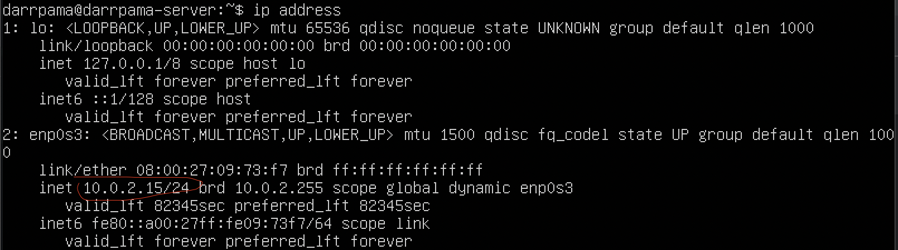
* DHCP — протокол прикладного уровня модели TCP/IP, служит для назначения IP-адреса клиенту. Это следует из его названия — Dynamic Host Configuration Protocol. IP-адрес можно назначать вручную каждому клиенту, то есть компьютеру в локальной сети. DHCP-серверы централизованно управляют IP-адресами и связанными с ними сведениями и автоматически предоставляют их клиентам. Это позволяет настраивать параметры клиента сети на сервере, а не на каждом компьютере в отдельности.

* Определил и вывел на экран внешний ip-адрес шлюза (ip) с помощью команды `curl ifconfig.me/ip` - 178.207.154.253 и внутренний IP-адрес шлюза, он же ip-адрес по умолчанию (gw) с помощью команды `ip route | grep default` - 10.0.2.2.

* Задал статичные (заданные вручную, а не полученные от DHCP сервера) настройки ip, gw, dns (использовал публичный DNS сервер, например 1.1.1.1 или 8.8.8.8). Создал файл `02-networkd.yaml` и установил доступ к файлу командой `sudo chmod 777 02-networkd.yaml`. Отредактировал его с помощью vi и подтвердил изменения командой `sudo netplan apply`. gw теперь равен 10.0.2.5, публичные серверы = 1.1.1.1 и 8.8.8.8
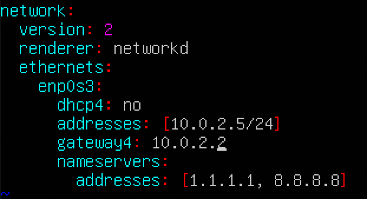

* Перезагрузил виртуальную машину командой `shuitdown -r now`. Убедился, что статичные сетевые настройки (ip, gw, dns) соответствуют заданным в предыдущем пункте с помощью команд `resolvectl status` и `ip a`.
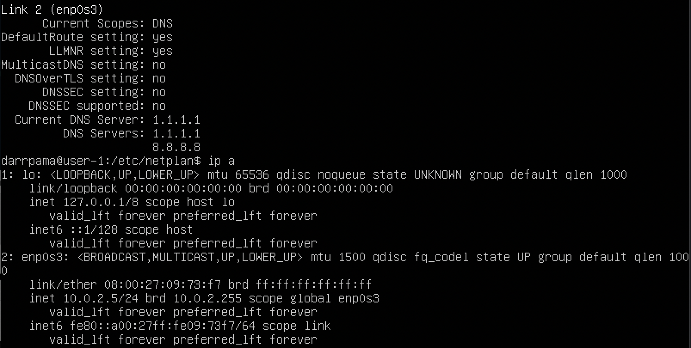

* Пропинговал сайт яндекса и 1.1.1.1.
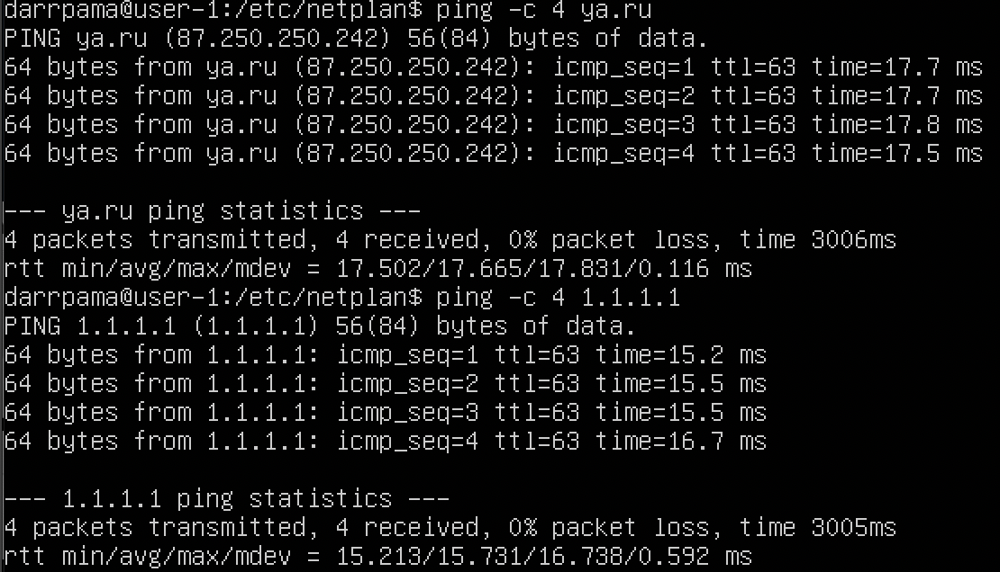

 

## Part 4. Обновление ОС

**== Задание ==**

##### Обновить системные пакеты до последней на момент выполнения задания версии.

- После обновления системных пакетов, если ввести команду обновления повторно, должно появится сообщение, что обновления отсутствуют.
- Вставить скриншот с этим сообщением в отчёт.

 

**== Выполнение ==**

* Обновил информацию о пакетах выполнив `sudo apt-get update`

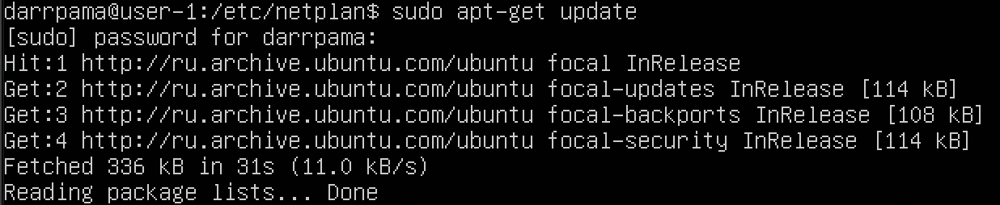

* Установил обновления для пакетов выполнив `sudo apt-det upgrade`

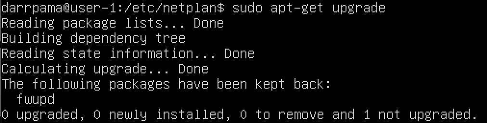

 

## Part 5. Использование команды **sudo**

**== Задание ==**

##### Разрешить пользователю, созданному в [Part 2], выполнять команду sudo.

- В отчёте объяснить *истинное* назначение команды sudo. 
- Поменять hostname ОС от имени пользователя, созданного в пункте 2 (используя sudo).
- Вставить скрин с изменённым hostname в отчёт.

**== Выполнение ==**

* sudo (англ. Substitute User and do, дословно «подменить пользователя и выполнить») — программа для системного администрирования UNIX-систем, позволяющая делегировать те или иные привилегированные ресурсы пользователям с ведением протокола работы. Основная идея — дать пользователям как можно меньше прав, при этом достаточных для решения поставленных задач. Команда sudo предоставляет возможность пользователям выполнять команды от имени суперпользователя root, либо других пользователей. Правила, используемые sudo для принятия решения о предоставлении доступа, находятся в файле /etc/sudoers.
В большинстве случаев грамотная настройка sudo делает небезопасную работу от имени суперпользователя ненужной. Все действия оказываются выполнимы из-под аккаунта пользователя, которому разрешено использовать sudo без ограничений. Имеется возможность запрещать и разрешать определённым пользователям или группам выполнение конкретного набора программ, а также разрешить выполнение определённых программ без необходимости ввода своего пароля.

* Командой `sudo usermod -a -G sudo darrpama2` разрешил пользователю использовать sudo
* Сменил пользователя командой `sudo su - darrpama2`
* Изменил hostname `sudo vi /etc/hostname`
* Посмотрел результат `cat /etc/hostname`

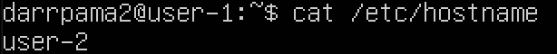

 

## Part 6. Установка и настройка службы времени

**== Задание ==**

##### Настроить службу автоматической синхронизации времени.  

- Вывести время, часового пояса, в котором вы сейчас находитесь.
- Вывод следующей команды должен содержать `NTPSynchronized=yes`: \
  `timedatectl show`
- Вставить скрины с корректным временем и выводом команды в отчёт.

**== Выполнение ==**

* Установил NTP командой `sudo apt install systemd-timesyncd`

* Активировал NTP командой `sudo timedatectl set-ntp on`

* Вывод команды `timedatectl show`

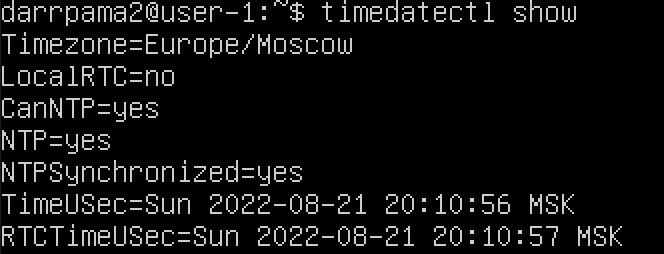

 

## Part 7. Установка и использование текстовых редакторов.

**== Задание ==**

##### Установить текстовые редакторы **VIM** (+ любые два по желанию **NANO**, **MCEDIT**, **JOE** и т.д.)  
##### Используя каждый из трех выбранных редакторов, создайте файл *test_X.txt*, где X -- название редактора, в котором создан файл. Напишите в нём свой никнейм, закройте файл с сохранением изменений.  
- В отчёт вставьте скриншоты:
  - Из каждого редактора с содержимым файла перед закрытием.
- В отчёте укажите, что сделали для выхода с сохранением изменений.
##### Используя каждый из трех выбранных редакторов, откройте файл на редактирование, отредактируйте файл, заменив никнейм на строку "21 School 21", закройте файл без сохранения изменений.
- В отчёт вставьте скриншоты:
    - Из каждого редактора с содержимым файла после редактирования.
- В отчёте укажите, что сделали для выхода без сохранения изменений.
##### Используя каждый из трех выбранных редакторов, отредактируйте файл ещё раз (по аналогии с предыдущим пунктом), а затем освойте функции поиска по содержимому файла (слово) и замены слова на любое другое.
- В отчёт вставьте скриншоты:
    - Из каждого редактора с результатами поиска слова.
    - Из каждого редактора с командами, введёнными для замены слова на другое.

**== Выполнение ==**

* Используя команду `sudo apt install mcedit` установил текстовый редактор MCEDIT

#### Exercise 1:

* **VIM**

* Создаем файл с помощью команды `vim test_VIM.txt`

* Нажимаем на "i" в самом редакторе, для редактирования

* Пишу свой ник: "darrpama"

Для выхода с сохранением нажимем `Esc` вводим команду `:wq` и нажимаем `Enter`

 *VIM* 

 

* **NANO**

* Создаем файл с помощью команды `nano test_NANO.txt`

* Пишу свой ник: "darrpama"

* Для выхода с сохранением нажимаем комбинацию `control+x` вводим `Y` и нажимаем`Enter`

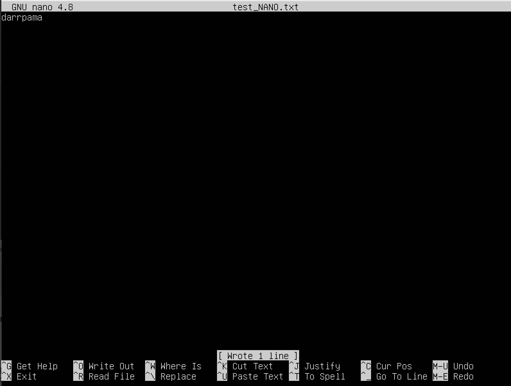 *NANO* 

 

* **MCEDIT**

* Cоздаем файл с помощью команды `mcedit test_MCEDIT.txt`

* Пишу свой ник: "darrpama"

* Для выхода с сохранением нажимаем `Esc` и подтверждаем выход с сохранением

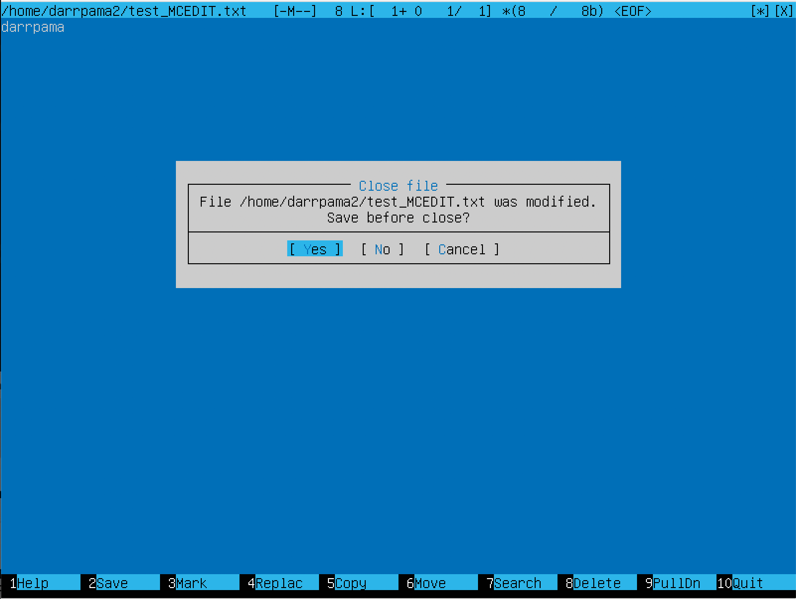 *MCEDIT* 

 

#### Exercise 2:

* **VIM**

* Открываем файл с помощью команды `vim test_VIM.txt`

* Нажимаем на "i" в самом редакторе, для редактирования

* Изменяем "darrpama" на "21 School 21"

* Для выхода без сохранения нажимаем `Esc` вводим команду `:q!` и нажимаем `Enter`

 *VIM* 

* **NANO**

* Открываем файл с помощью команды `nano test_NANO.txt`

* Изменяем "darrpama" на "21 School 21"

* Для выхода без сохранения нажимаем комбинацию `control+x` потом `N`

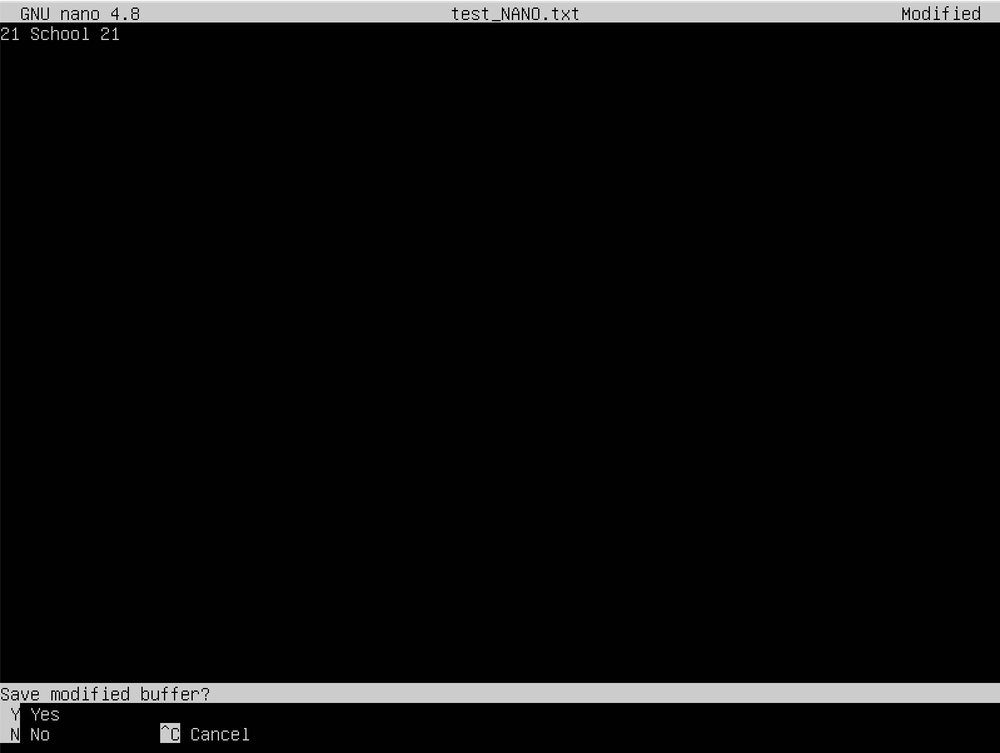 *NANO* 

* **MCEDIT**

* Открываем файл с помощью команды `mcedit test_MCEDIT.txt`.

* Изменяем "darrpama" на "21 School 21"

* Для выхода без сохранения нажимаем `Esc` и подтверждаем выход без сохранения

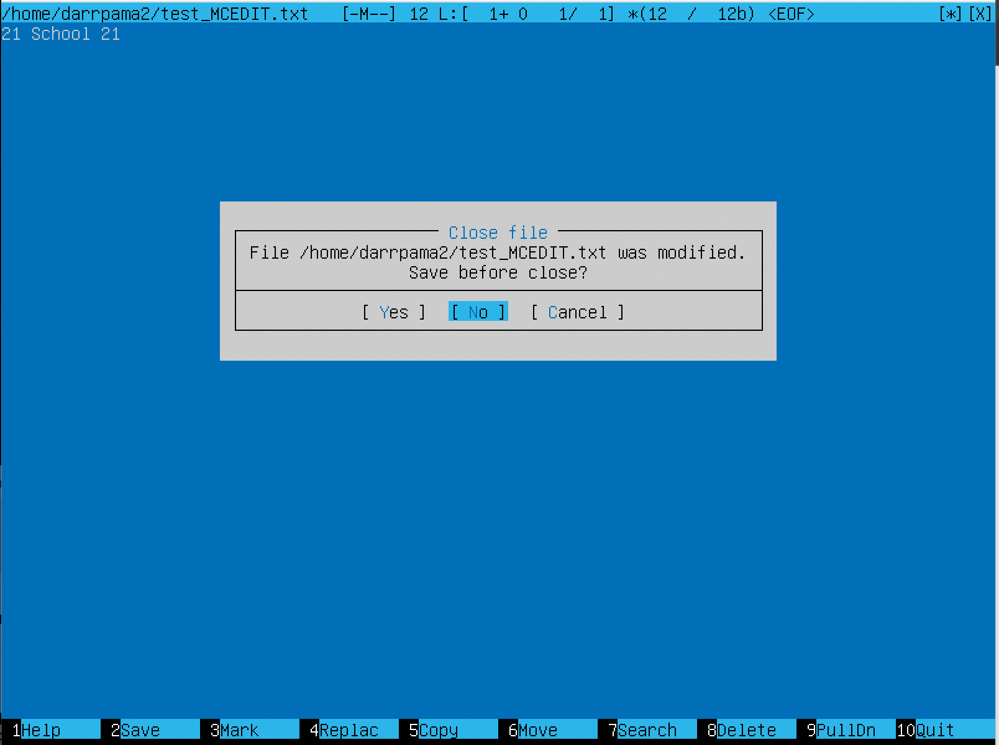 *MCEDIT* 

#### Exercise 3:

* **VIM**

* Открываем файл с помощью команды `vim test_VIM.txt`

* Для поиска в VIM вводим `/darrpama` и искомое слово выделяется в самом редакторе

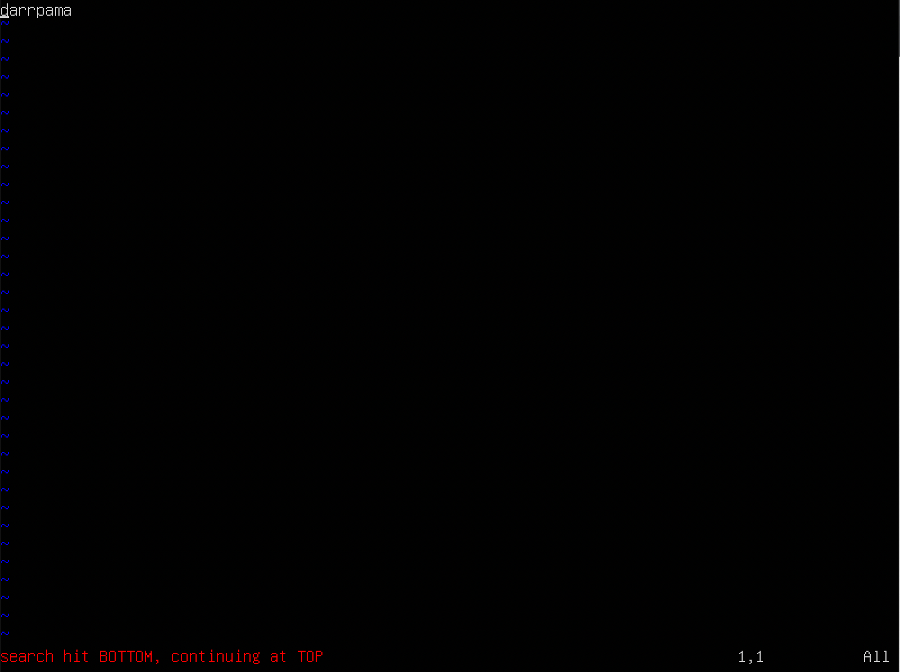 *VIM* 

* Для замены слова в VIM вводим `:%s/darrpama/21 School 21` и слово "carnaget" заменяется на "21 School 21"

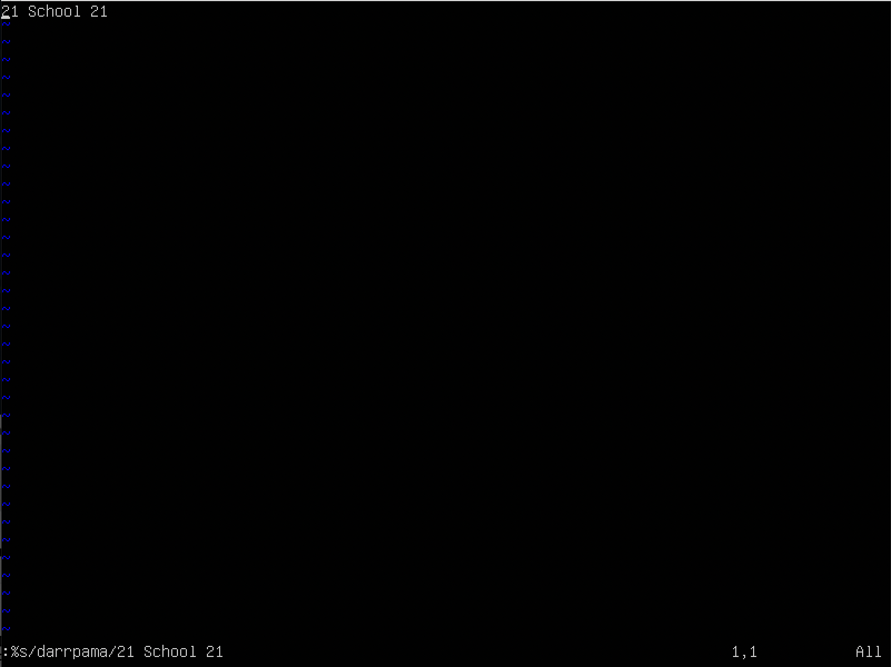 *VIM* 

 

* **NANO**

* Открываем файл с помощью команды `nano test_NANO.txt`

* Для поиска в NANO вводим `control + W`

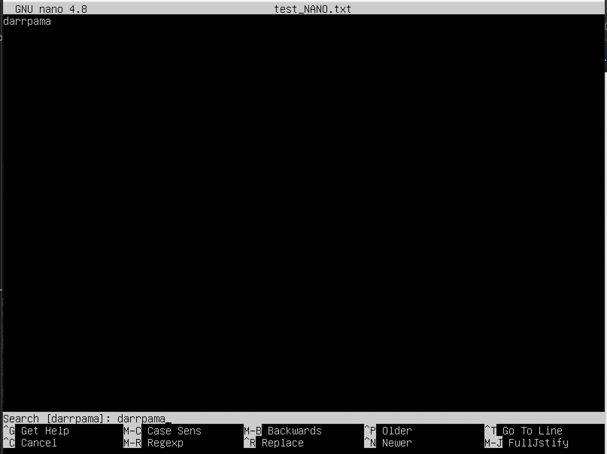 *NANO* 

* Для замены слова в NANO вводим `control + \`, пишем "darrpama", нажимаем `Enter`, пишем "21 School 21", нажимаем `Enter`, выбираем `Y`

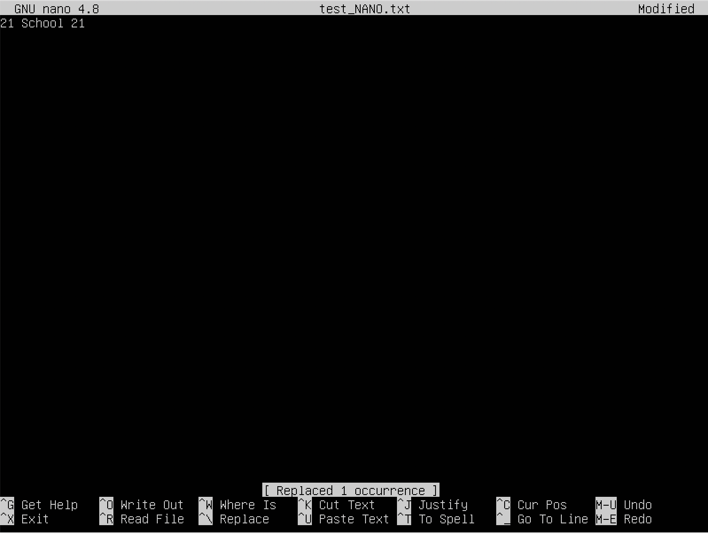 *NANO* 

 

* **MCEDIT**

* Открываем файл с помощью команды `mcedit test_MCEDIT.txt`.

* Для поиска нажимаем F7, пишем darrpama, стрелкой вниз переходим в меню, нажимаем a, w нажимаем o.

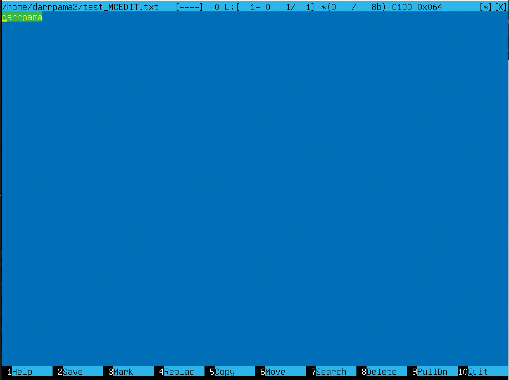 *MCEDIT* 

* Для замены слова в MCEDIT нажимаем `F4`, пишем "darrpama", во второй строке пишем 21 School 21, стрелкой вниз переходим в меню, нажимаем А, нажимаем O, нажимаем R.

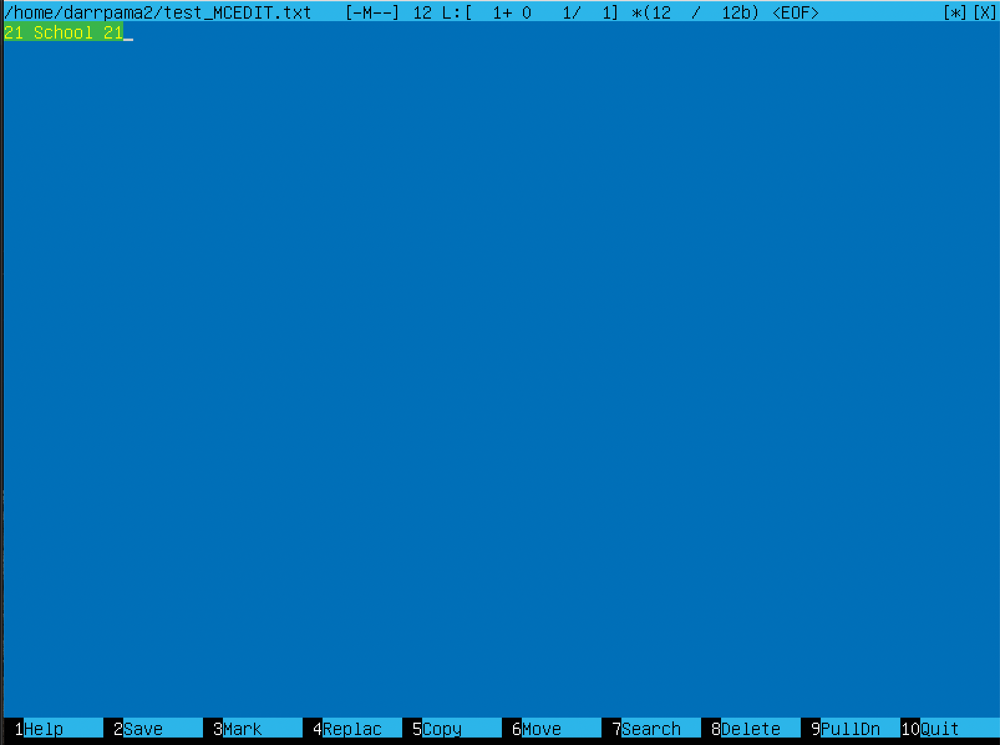 *MCEDIT* 

 

## Part 8. Установка и базовая настройка сервиса **SSHD**

**== Задание ==**

##### Установить службу SSHd.  
##### Добавить автостарт службы при загрузке системы.  
##### Перенастроить службу SSHd на порт 2022.  
##### Используя команду ps, показать наличие процесса sshd. Для этого к команде нужно подобрать ключи.
- В отчёте объяснить значение команды и каждого ключа в ней.
##### Перезагрузить систему.
- В отчёте опишите, что сделали для выполнения всех пяти пунктов (можно как текстом, так и скриншотами).
- Вывод команды netstat -tan должен содержать  \
`tcp 0 0 0.0.0.0:2022 0.0.0.0:* LISTEN`  \
(если команды netstat нет, то ее нужно установить)
- Скрин с выводом команды вставить в отчёт.
- В отчёте объяснить значение ключей -tan, значение каждого столбца вывода, значение 0.0.0.0.

**== Выполнение ==**

* Устанавливаем службу SSHd командой `sudo apt install openssh-server`

* Проверяем наличие командой `ssh -V`
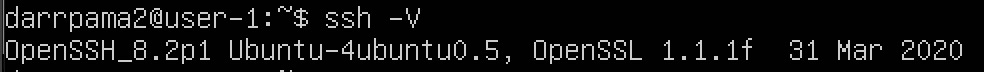

* Добавляем автостарт службы SSHd командой `sudo update-rc.d ssh defaults`

* Изменяем порт SSHd командой `sudo vim /etc/ssh/sshd_config`

* Добавляем строку `Port 2022`
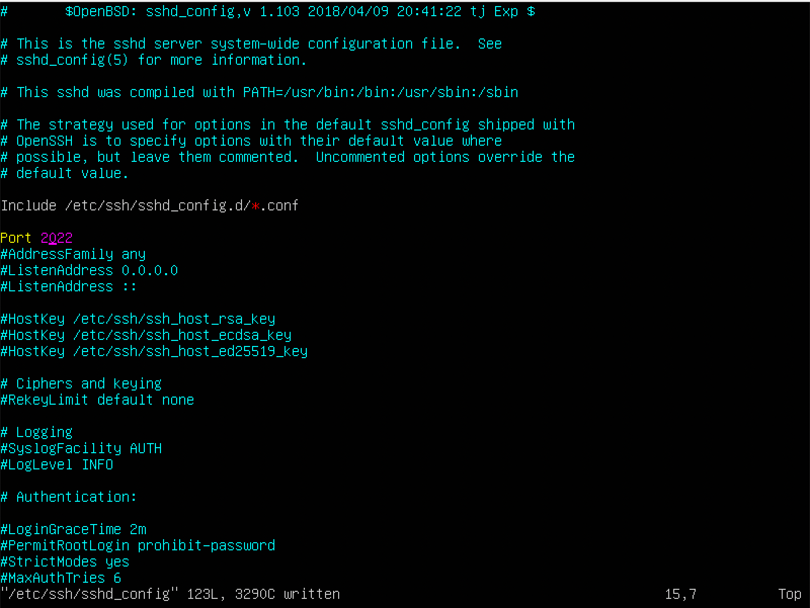

* Используем команду `/etc/init.d/ssh restart` для того что бы изменения вступили в силу
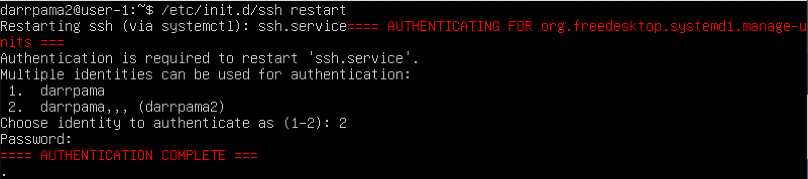

Используем команду `ps -axfv | grep sshd` для проверки наличия процесса
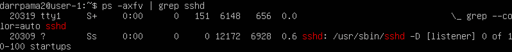

* Команда `ps` показывает текущие процессы на сервере.

* Команда `grep` позволяет выдилить нужную нам информацию по процессам

* флаг -a оставляет все процессы, кроме лидеров сеансов и процессов, не связанных с терминалом

* флаг -x заставляет `ps` отображать список всех процессов, которыми вы владеете

* флаг -f выводит полноформатный список

* флаг -v выводит информацию о версии

 
* Устанавливаем *net-tools* `sudo apt install net-tools`

* Выполняем команду `netstat -tan`
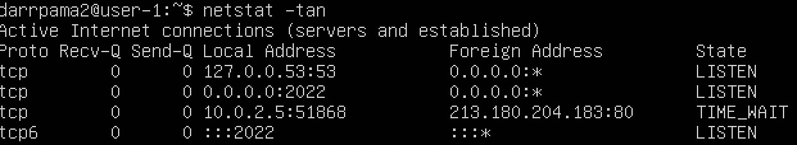

* Опция -a показывает состояние всех сокетов

* -n показывает ip адрес, а не сетевое имя

* -t показывает только tcp соединения

* столбец Proto - протокол, используемый сокетом

* столбец Recv-Q - количество байтов, не скопированных пользовательской программой, подключенной к этому сокету

* столбец Local Address - локальный адрес (имя локального хоста) и номер порта сокета

* стобец Foreign Address - удаленный адрес (имя удаленного хоста) и номер порта сокета

* стобец State - состояние сокета

* Перезагружаем систему командой `sudo reboot`

 

## Part 9. Установка и использование утилит **top**, **htop**

**== Задание ==**

##### Установить и запустить утилиты top и htop.  

##### По выводу команды top определить и написать в отчёте:
  * uptime
  * количество авторизованных пользователей
  * общую загрузку системы
  * общее количество процессов
  * загрузку cpu
  * загрузку памяти
  * pid процесса занимающего больше всего памяти
  * pid процесса, занимающего больше всего процессорного времени
##### В отчёт вставить скрин с выводом команды htop:
  * отсортированному по PID, PERCENT_CPU, PERCENT_MEM, TIME
  * отфильтрованному для процесса sshd
  * с процессом syslog, найденным, используя поиск 
  * с добавленным выводом hostname, clock и uptime

  **== Выполнение ==**

  * Командой `top` запускаем утилиту, она установлена по умолчанию
  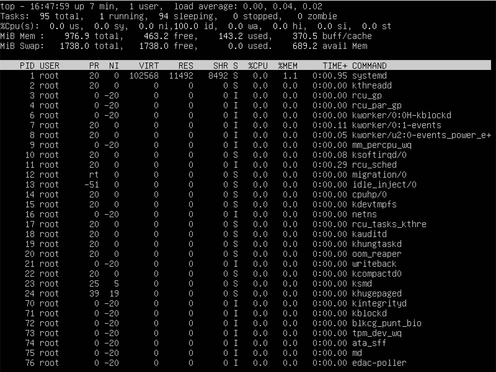

  * uptime
  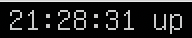

  * Количество авторизованных пользователей
  

  * Общая загрузка системы 
  

  * Общее количество процессов
  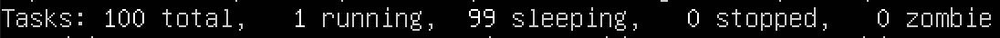

  * загрузка cpu
  

  * загрузка памяти
  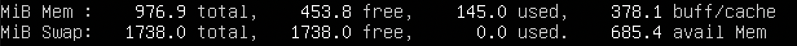

  * pid процесса, занимающего больше всего памяти, сортировка по памяти выполняется с помощью `Shift + M`.
  

  * pid процесса, занимающего больше всего процессорного времени, сортировка по процессорному времени выполняется с помощью `Shift + P`.
  

  * Командой `htop` запускаем следующую утилиту.

   *Запуск htop* 

  * Для выбора того как проводить сортировку мы нажимаем `F6`

  * PID
  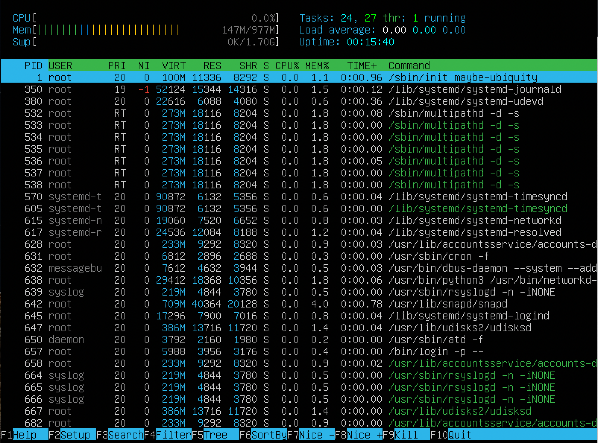

  * PERCENT_CPU
  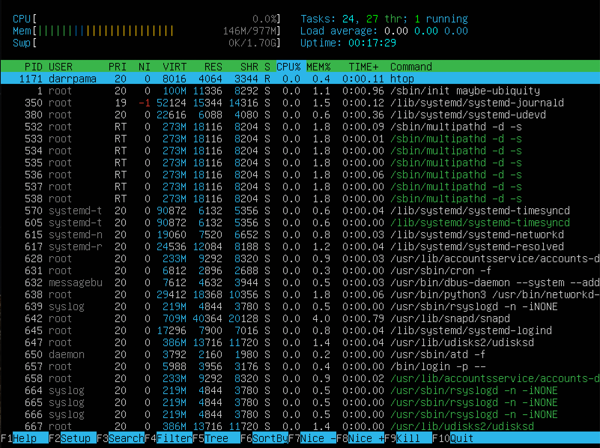

  * PERCENT_MEM
  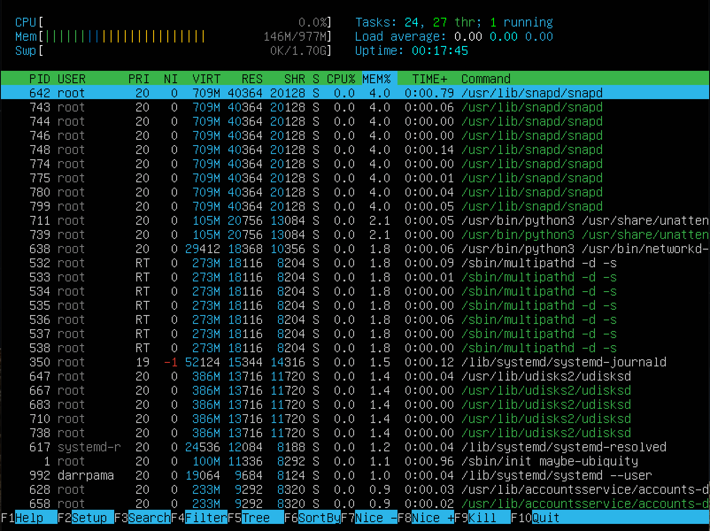

  * TIME
  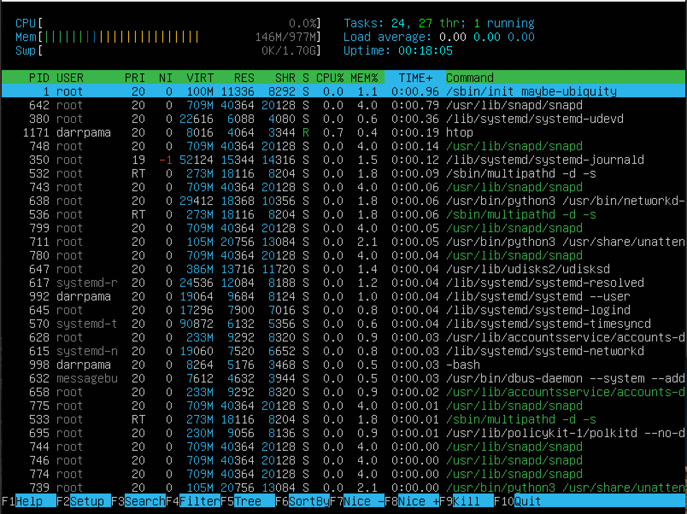

  * Для работы с фильтром нажимаем `F4`

  * После мы вводим `sshd` и нажимаем `Enter`

  * фильтр по sshd
  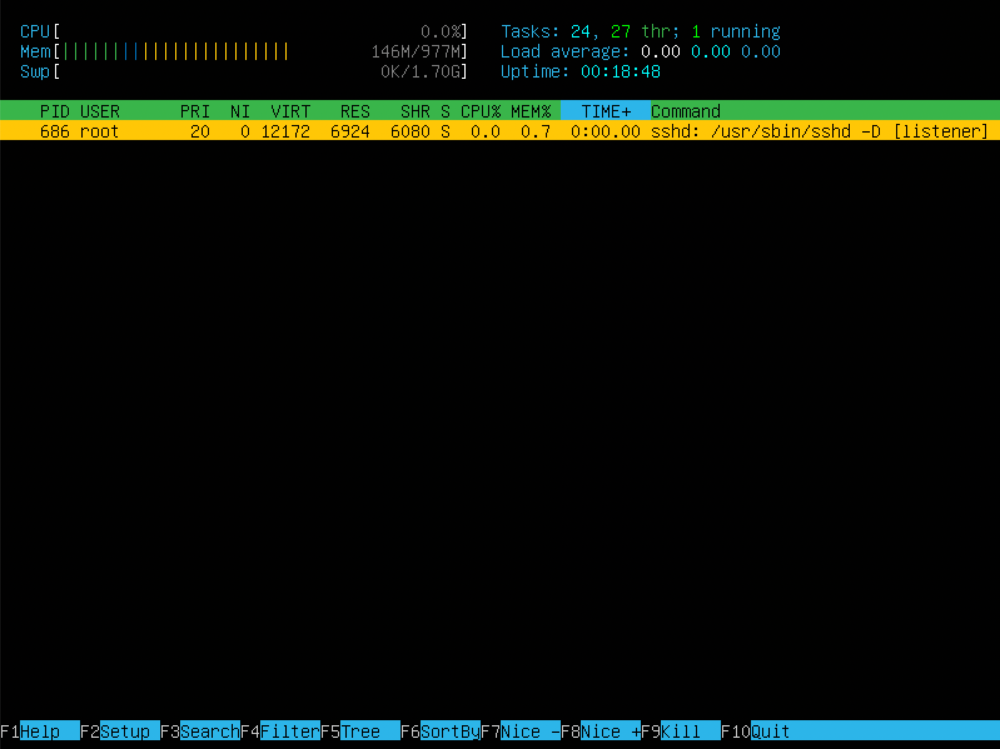

  * Для работы с поиском нажимаем `F3`

  * После мы вводим `syslog` и нажимаем `Enter`

  * Результат поиска
  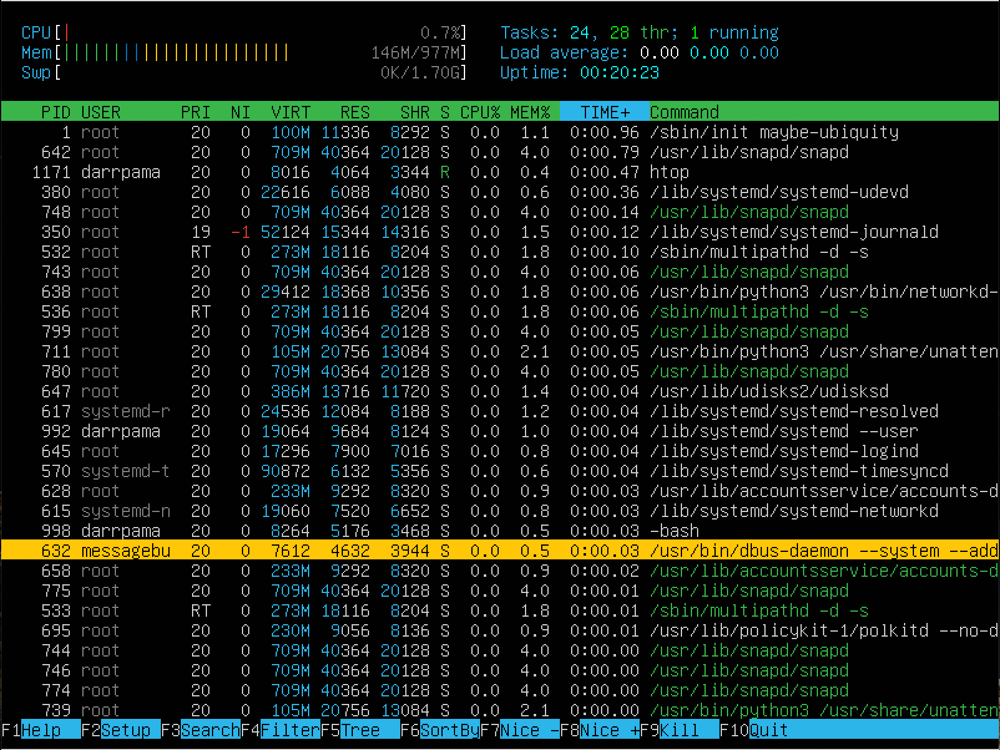

  * Для настройки htop нажимаем `F2` и с помощью стрелок добавляем вывод hostname, clock и uptime
  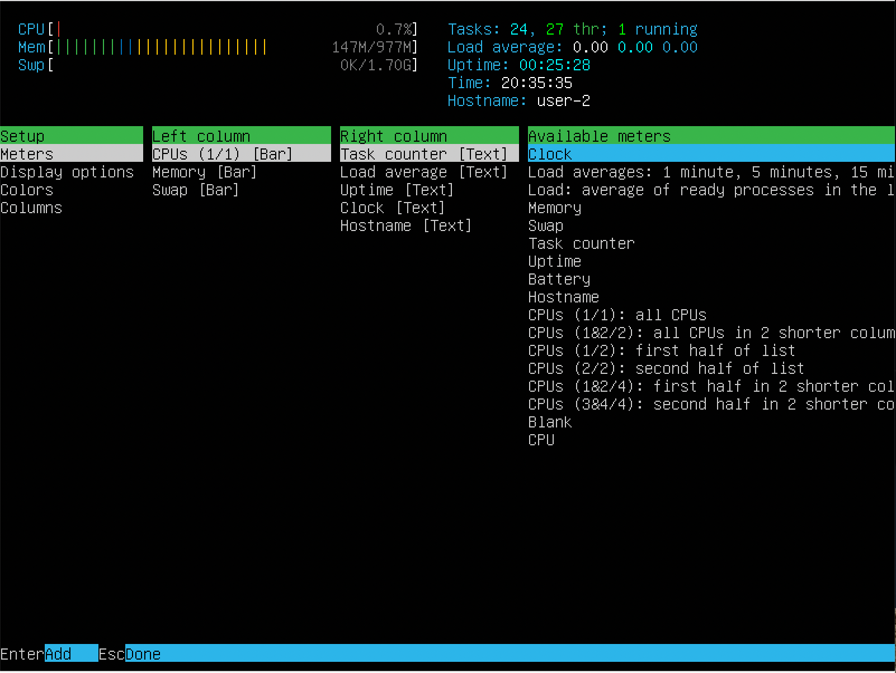

  * Настроенный htop
  
   

  ## Part 10. Использование утилиты **fdisk**

  **== Задание ==**

  ##### Запустить команду fdisk -l.
    * В отчёте написать название жесткого диска, его размер и количество секторов, а также размер swap.

   

  **== Выполнение ==**

  * Запустил утилиту командой `sudo fdisk -l`
  

  * Название жесткого диска `VBOX HARDDISK`

  * Размер диска `10 GiB`

  * Количество секторов `20971520`

  *  Размер swap узнал с помощью команды `free -h`
  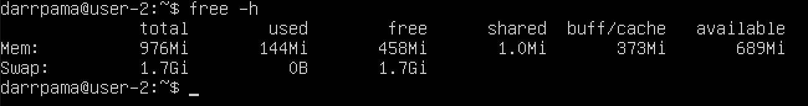

   

  ## Part 11. Использование утилиты **df**

  **== Задание ==**

  ##### Запустить команду df.  
  * В отчёте написать для корневого раздела (/):
    * размер раздела
    * размер занятого пространства
    * размер свободного пространства
    * процент использования
  * Определить и написать в отчёт единицу измерения в выводе.  

  ##### Запустить команду df -Th.
  * В отчёте написать для корневого раздела (/):
      * размер раздела
      * размер занятого пространства
      * размер свободного пространства
      * процент использования
  * Определить и написать в отчёт тип файловой системы для раздела.

   

  **== Выполнение ==**

  * Запустил команду `df`
  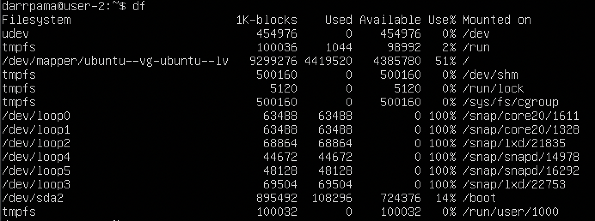
  * Размер раздела `/` 9299276 кБайт
  * Размер занятого пространства `/` 4419520 кБайт
  * Размер свободного пространства `/` 4385780 кБайт
  * Процент использования `/` 51%
  * В GNU единица измерения 1K-block это 1024 байта

   

  * Запустил команду `df -Th`
  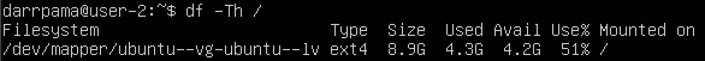
  * Размер раздела `/` 8.9 ГБайт
  * Размер занятого пространства `/` 4.3 ГБайт
  * Размер свободного пространства `/` 4.2 ГБайт
  * Процент использования `/` 51%
  * Тип файловой системы - `ext4`

   

  ## Part 12. Использование утилиты **du**

  **== Задание ==**

  ##### Запустить команду du.

  ##### Вывести размер папок /home, /var, /var/log (в байтах, в человекочитаемом виде)

  ##### Вывести размер всего содержимого в /var/log (не общее, а каждого вложенного элемента, используя *)

  * В отчёт вставить скрины с выводом всех использованных команд.

   

  **== Выполнение ==**

  * Запуcк команды `du`
  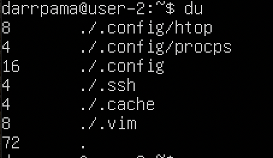

  * С помощью команды `sudo du -sh /home && sudo du -sh /var && sudo du -sh /var/log` выводим размер папок
  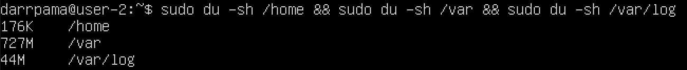
      
  * Вывел размер `/var/log` с помощью команды `sudo du -sh /var/log/*`
  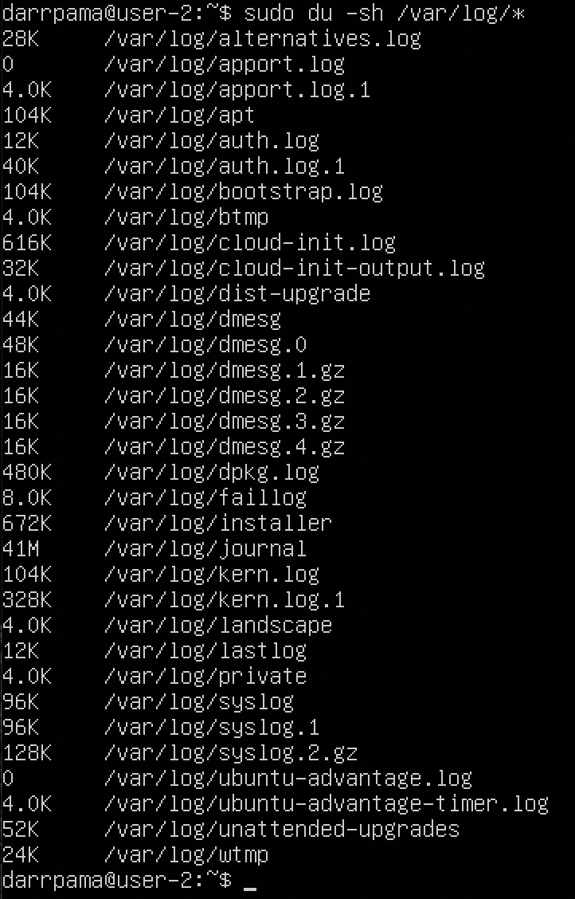

   

  ## Part 13. Установка и использование утилиты **ncdu**

**== Задание ==**

* Установить утилиту ncdu.

* Вывести размер папок /home, /var, /var/log.

- Размеры должны примерно совпадать с полученными в [Part 12](#part-12-использование-утилиты-du).

- В отчёт вставить скрины с выводом использованных команд.

 

**== Выполнение ==**

* Командой `sudo apt install ncdu` устанавливаем ncdu

* Вывел размер папок с помощью команды `ncdu`

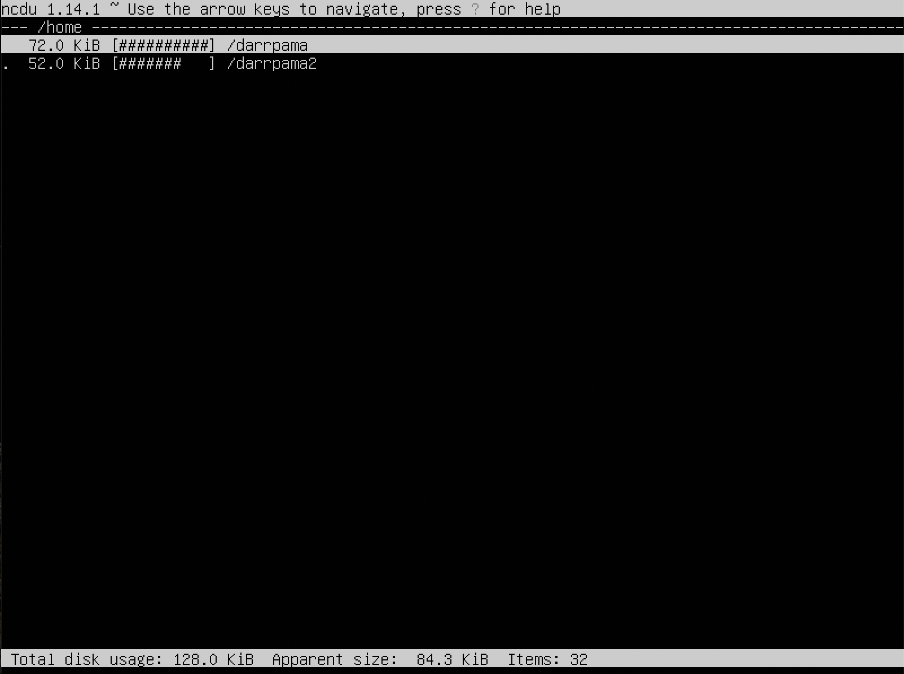 

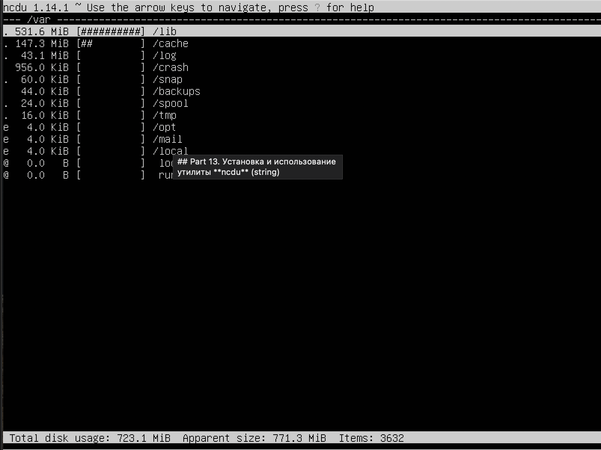 

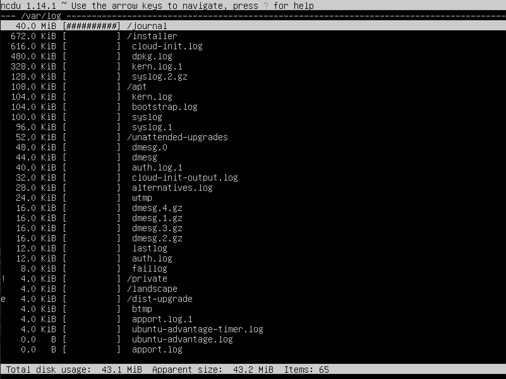 

 

## Part 14. Работа с системными журналами

**== Задание ==**

##### Открыть для просмотра:
* /var/log/dmesg
* /var/log/syslog
* /var/log/auth.log  

##### Написать в отчёте время последней успешной авторизации, имя пользователя и метод входа в систему.
##### Перезапустить службу sshd.
##### Вставить в отчёт скрин с сообщением о рестарте службы (искать в логах).

 

**== Выполнение ==**

* Просмотр /var/log/dmesg с помощью vim
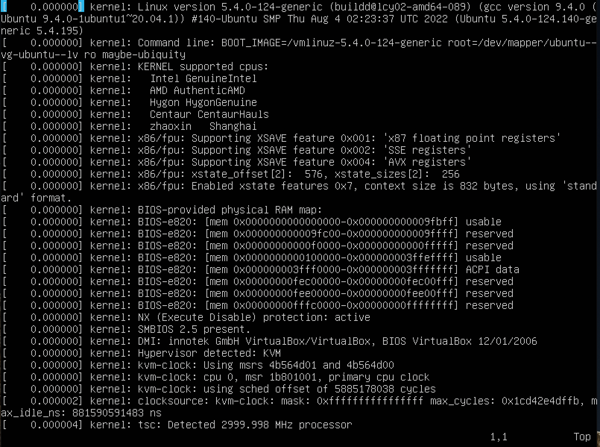

* Просмотр /var/log/syslog с помощью vim
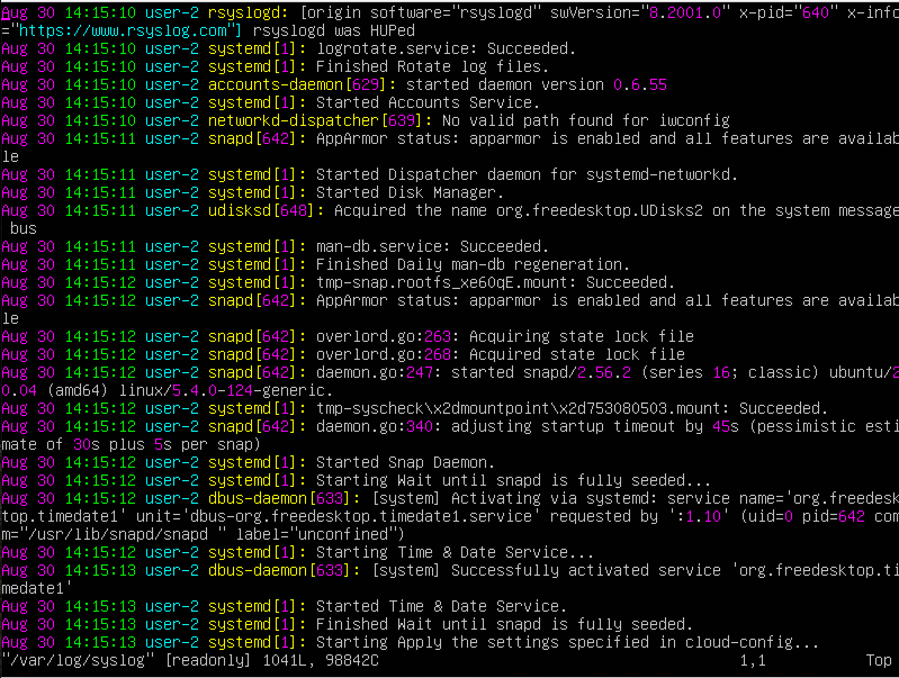

* Просмотр /var/log/auth.log с помощью vim
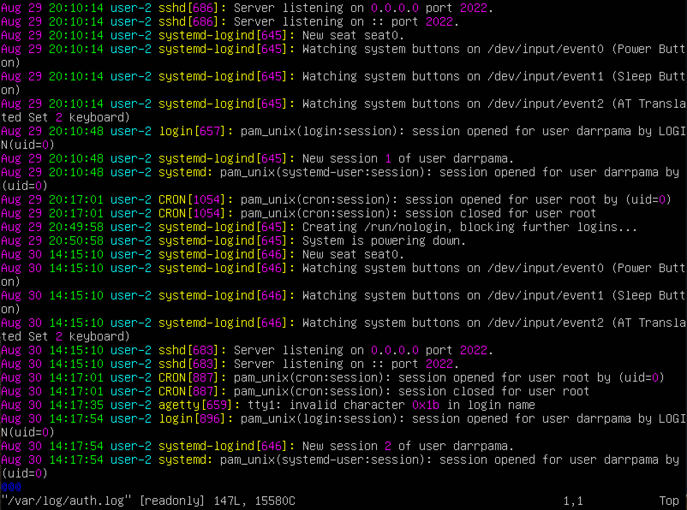
    

* Время авторизации Aug 30 15:45:07
* Имя пользователя darrpama
* Метод входа в систему tty1

* Командой `sudo /etc/init.d/ssh restart` перезапускаем службу SSHd

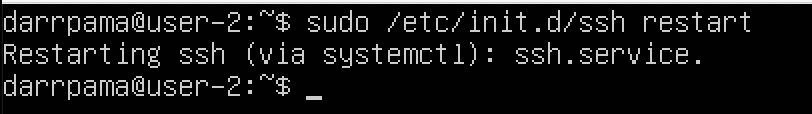 *Результат работы команды* 

* Командой `vim /var/log/syslog` смотрим системные логи
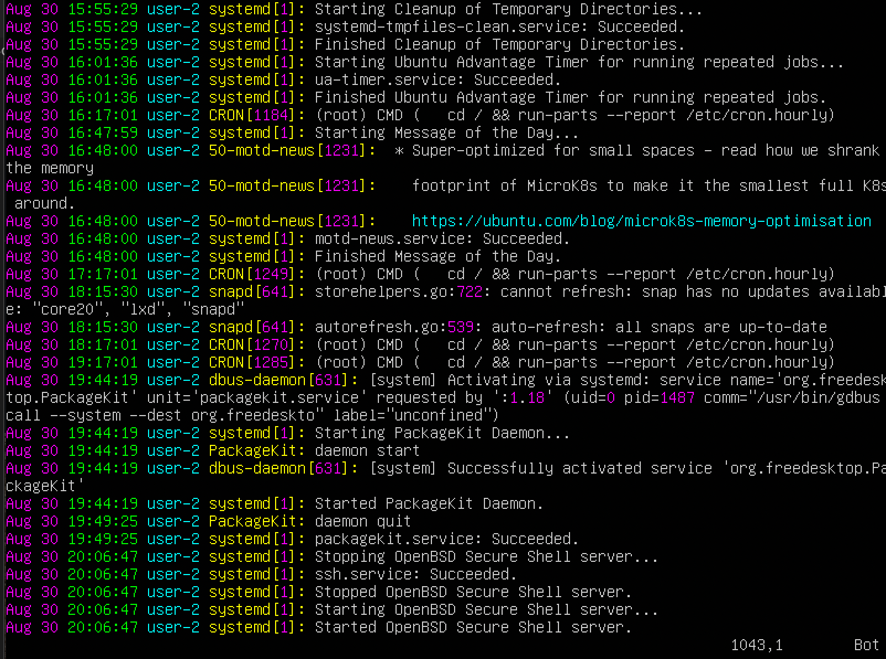 *Результат работы команды* 

 

## Part 15. Использование планировщика заданий **CRON**

**== Задание ==**

##### Используя планировщик заданий, запустите команду uptime через каждые 2 минуты.
* Найти в системных журналах строчки (минимум две в заданном временном диапазоне) о выполнении.
* Вывести на экран список текущих заданий для CRON.
* Вставить в отчёт скрины со строчками о выполнении и списком текущих задач.

##### Удалите все задания из планировщика заданий.
* В отчёт вставьте скрин со списком текущих заданий для CRON.

 

**== Выполнение ==**

* Используем команду `sudo apt install cron` для установки **CRON**

* Также дополнительно устанавливам postfix командой `sudo apt install postfix`

* Планируем задачу командой `crontab -e`

* В vim приписываем `"*/2 * * * * uptime"` в конце файла должна быть пустая строка

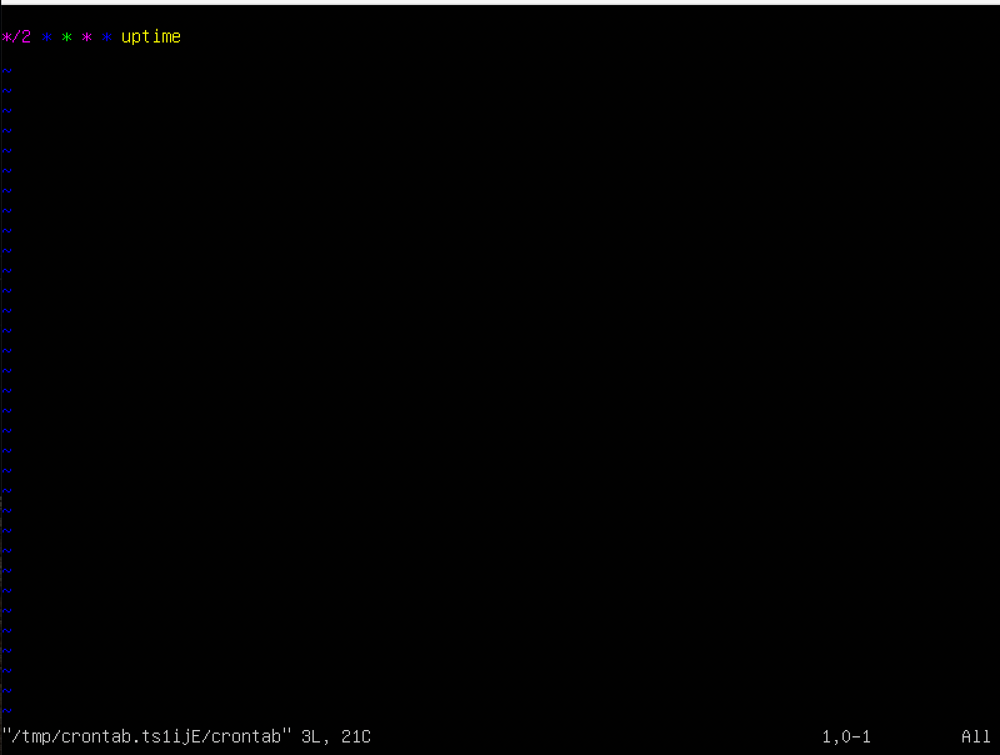 *uptime* 

* Командой `crontab -l` выводим список установленых задач

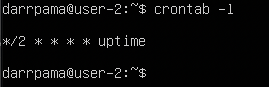 *Список текущих заданий* 

* Командой `sudo grep CRON /var/log/syslog` выводим системных задач

 *Системный журнал* 

* Командой `crontab -r` удаляем все запланированые задачи

* Проверяем список задач ещё раз

 *Системный журнал* 
